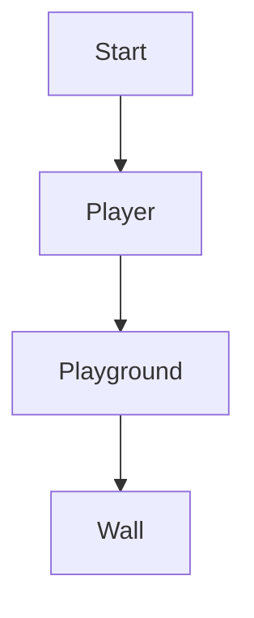

# Game Reactris

This is a clone of the tetris game done in React and Typescript. It is a simple project to learn especially react but also other
languages and deploy techniques. Of course it is a full blown tetris with some interesting blocks that is self invented. It is easy
to extend with your own block structures.
It is an ongoing process there multiple techniques including testing with jest and deploying and hosting with docker
will be used. I have also tried to make it available in both windows and linux environments.

The project was bootstrapped with [Create React App](https://github.com/facebook/create-react-app) and uses some parameters for
typescript (see below).

Configure and setup:

### `yarn`

Use yarn or npm to setup and configure the project. Be sure to install nodejs (npm). There could be some issues with the npm version.

### `yarn install`

Install all dependencies to run the game.

### `yarn start`

To develop and to start the game (web server)

Run the webserver and start the game with `yarn start` or `npm start`.
The game will be a SPA on port 3000 (localhost:3000) and will be injected in the index.html file.
Built partial with MVP pattern design where the model is written in typescript and the view part in React-Typescript.

## Backlog:

This is a list of the bugs and missing features of the app.
[View backlog](https://github.com/users/pertan4711/projects/3/views/1)

## Available Scripts

In the project directory, you can run:

### `yarn start`

Runs the app in the development mode.\
Open [http://localhost:3000](http://localhost:3000) to view it in the browser.

The page will reload if you make edits.\
You will also see any lint errors in the console.

### `yarn test`

Launches the test runner in the interactive watch mode.\
See the section about [running tests](https://facebook.github.io/create-react-app/docs/running-tests) for more information.
It is possible to start a debug session with tests by typing "JavaScript Debug Terminal" and when write

### `yarn test --watch`

Sätt brytpunkter som vanligt i testfilen (Tetris.test.js)

### `yarn build`

Builds the app for production to the `build` folder.\
It correctly bundles React in production mode and optimizes the build for the best performance.

The build is minified and the filenames include the hashes.\
Your app is ready to be deployed!

See the section about [deployment](https://facebook.github.io/create-react-app/docs/deployment) for more information.

### `yarn eject`

**Note: this is a one-way operation. Once you `eject`, you can’t go back!**

If you aren’t satisfied with the build tool and configuration choices, you can `eject` at any time. This command will remove the single build dependency from your project.

Instead, it will copy all the configuration files and the transitive dependencies (webpack, Babel, ESLint, etc) right into your project so you have full control over them. All of the commands except `eject` will still work, but they will point to the copied scripts so you can tweak them. At this point you’re on your own.

You don’t have to ever use `eject`. The curated feature set is suitable for small and middle deployments, and you shouldn’t feel obligated to use this feature. However we understand that this tool wouldn’t be useful if you couldn’t customize it when you are ready for it.

## Additional

- There is a sandboxed clone of this code in [CodeSandbox](https://codesandbox.io/s/reactris-ng769y?file=/src/index.tsx)
- You can build docker image

