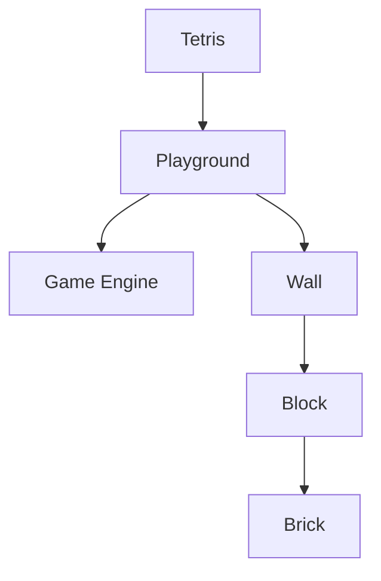

# Game Reactris

This is a clone of the tetris game done in React and Typescript. It is a simple project to learn especially react but also other languages and deploy techniques. Of course it is a full blown tetris with some interesting blocks that is self invented. It is easy to extend with your own block structures. It is an ongoing process there multiple techniques including testing with jest and deploying and hosting with docker will be used. 

The game engine is done in purly Typescript and could be tested separatly. The game GUI is done in react and main loop is refactored into the state component 'UseGameState.tsx'.

The project was bootstrapped with [Create React App](https://github.com/facebook/create-react-app) and uses some parameters for typescript (see below).

Configure and setup:
- `yarn install`
- `yarn start`
- `yarn test`
- `yarn test --watch`
- `yarn build`

Run the webserver and start the game with `yarn start` or `npm start`.
The game will be a SPA on port 3000 (localhost:3000) and will be injected in the index.html file. Built partial with MVP pattern design where the model is written in typescript and the view part in React-Typescript.

## Backlog:
This is a list of the bugs and missing features of the app.
[View backlog](https://github.com/users/pertan4711/projects/3/views/1)

## Game Architecture
The game follows the MVP (Model-View-Presenter) pattern. Here is a brief overview of the main components:

- **Model**: The game logic and state management are handled by the model classes. The main model class is [`playGroundModel`](src/model/playground.ts), which manages the game state, active block, and wall. Other model classes include various block types such as [`leftblock`](src/model/blocks/leftblock.ts), [`rightblock`](src/model/blocks/rightblock.ts), and [`lineblock`](src/model/blocks/lineblock.ts).

- **View**: The view components are responsible for rendering the game UI. The main view component is [`Playground`](src/components/Playground.tsx), which renders the active block, wall, and score. Other view components include [`Block`](src/components/game/Block.tsx), [`Wall`](src/components/game/Wall.tsx), and [`ScoreBoard`](src/components/board/Score.tsx).

- **Presenter**: The presenter component [`UseGameState`](src/components/UseGameState.tsx) handles the game state and user interactions. It uses React hooks to manage the game state and update the view components.

## Key Files and Directories

- `src/components`: Contains the React components for the game UI.
- `src/model`: Contains the TypeScript classes for the game logic and state management.
- `src/utils`: Contains utility functions such as [`calculateBrickSize`](src/utils/utils.ts).
- `src/test`: Contains the Jest test files for the game.

## UML Diagrams
The project includes UML diagrams to illustrate the structure of the application. These diagrams are located in the `doc/uml` directory. You have to install PUML to read those.

### Domain Model

### Sequence Diagram

## Enhancement and future
I will propably do a rework with Next and Tailwind just to mirror the current project I am working on.

## Additional
- There is a sandboxed clone of this code in [CodeSandbox](https://codesandbox.io/s/reactris-ng769y?file=/src/index.tsx)
- You can build docker image

## Reference
Pluralsight courses:
- "React 17: Getting started" (retired) with Samer Buna
- "React 18 Fundamentals" by Roland Guijt