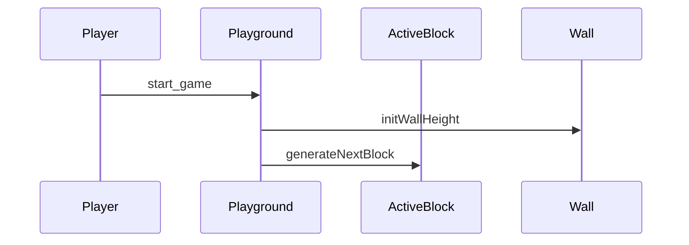

# UML diagrams

A popular UML diagram tool is PlantUML. I provided a simple domain model and sequence diagram to illustrate the structure of the application.

### Installation

Use the PlantUML extension in VSCode or Notepad++. You have to ensure you have got a Java runtime as well.

```
sudo apt update
sudo apt install openjdk
```
I some cases you have to install graphviz as well.

```
sudo apt update
sudo apt install default-jre
sudo apt install graphviz
```

Check documentation here:

```
https://plantuml.com/
https://crashedmind.github.io/PlantUMLHitchhikersGuide/

```

# Mermaid diagrams

Another popular tool that is gaining popularity is Mermaid. It has a similar code as Plant-UML but could be 
used in plain markdown files such as this file.

A real good thing about this is that it could be used at Github out of the box but to use it in vscode you 
have to install the "Markdown Preview Mermaid" extension.


